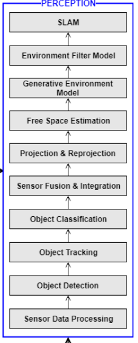
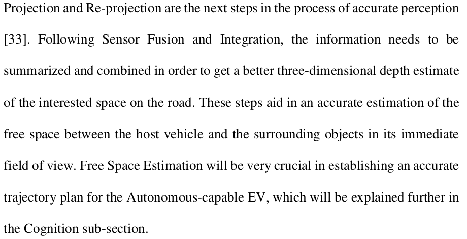

## 概念及术语  可行驶区域(freespace,drivable space,drivable region,Free-space Estimation )  disparity-差距,差别 elevation-海拔,高差
## [传统的方法总结](http://www.zyzhong.top/2018/01/16/%E5%8F%AF%E8%A1%8C%E9%A9%B6%E5%8C%BA%E5%9F%9F%E6%A3%80%E6%B5%8B/)
##论文及业界经验
#### Modeling of Drivable Free Space with Fused Camera Data for Autonomous Driving(借鉴思路,文章质量有待确认)
-  A common approach is to use grid maps where eachcell has a probability to be occupied
-  **introduced a new model express freespace**
#### Estimating Drivable Collision-Free Space from Monocular Video
- 两个问题
> 1.What is the most critical information necessary to avoid obstacles?
> 2.Can we come up with a cost-effective approach to obtain this critical information?
>**论文给出答案:It can easily be seen that the most critical information is the drivable free space that can be immediately reached by the autonomous vehicle without collision**

#### Free Space detection in real time on standard architectures such as smartphones(手机上检测)-NEXYAD Automotive & Transportation

#### **Stixels: Free Space and Object Segmentation In Traffic Environments,标出了高度,很有参考意义**

#### [6d-vision,stixels](http://www.6d-vision.com/autonomousdriving)
> [**单目相机stixel生成,知乎**](https://zhuanlan.zhihu.com/p/38590646)
#### [单镜头车辆测距](https://www.zhihu.com/people/liu-xing-ye-19-49/activities)
#### LEGO(同是出深度,边缘)
#### [自动驾驶方面2018年McMaster大学Kavya P. Divakarla的博士论文](https://macsphere.mcmaster.ca/bitstream/11375/23832/2/Divakarla_Kavya_finalsubmission2018December_PhD.pdf)
> 
> 

## 意义
在复杂场景下不可避免的需要freespace

python -m torch.distributed.launch --nproc_per_node=2 /home/liuli/2018trc/baidu/apollo-pilot/perception-tnt/model_tnt_torch/entries/train_net.py --config-file "model_tnt_torch/config_files/sfs/freespace_balance_neighbor_3x3.yaml"
